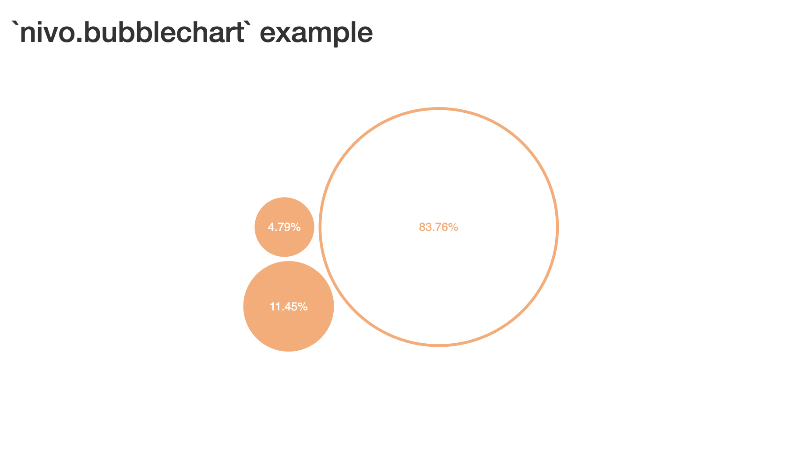

<!-- README.md is generated from README.Rmd. Please edit that file -->

```{r, include = FALSE}
knitr::opts_chunk$set(
  collapse = TRUE,
  comment = "#>",
  fig.path = "man/figures/README-",
  out.width = "100%"
)
```

# nivo.bubblechart 

<!-- badges: start -->
[](https://CRAN.R-project.org/package=nivo.bubblechart)
[](https://lifecycle.r-lib.org/articles/stages.html#stable)
[](https://github.com/DataRacerEdu/nivo.bubblechart/actions/workflows/R-CMD-check.yaml)
[](https://app.codecov.io/gh/DataRacerEdu/nivo.bubblechart?branch=main)
[](https://opensource.org/licenses/MIT)
[](https://cran.r-project.org/package=nivo.bubblechart)
<!-- badges: end -->

> Interactive bubble charts for R and Shiny using [Nivo](https://nivo.rocks)

**nivo.bubblechart** brings circle packing visualizations from the Nivo library to R, making it easy to create interactive bubble charts for both static documents and Shiny applications.

## Features

- **Clean defaults** - Professional visualizations with minimal configuration
- **Interactive** - Built-in hover effects and click event handling
- **Data frame support** - Easy conversion using `prepare_bubble_data()`
- **Shiny integration** - First-class support with event bindings
- **Customizable** - Control over colors, sizes, and interactions
- **Responsive** - Works across all screen sizes

## 📦 Installation

### CRAN

```r
install.packages("nivo.bubblechart")
```

### Development Version

```r
# Using pak
pak::pak("DataRacerEdu/nivo.bubblechart")

# Using remotes
remotes::install_github("DataRacerEdu/nivo.bubblechart")

# Using devtools
devtools::install_github("DataRacerEdu/nivo.bubblechart")
```

## 🚀 Quick Start

### Basic Example

```r
library(nivo.bubblechart)

# Prepare data
sample_data <- list(
  name = "root",
  children = list(
    list(name = "Apples",  value = 450, color = "#ff6b6b", labelColor = "#ffffff"),
    list(name = "Bananas", value = 320, color = "#feca57", labelColor = "#000000"),
    list(name = "Oranges", value = 280, color = "#ff9f43", labelColor = "#ffffff"),
    list(name = "Grapes",  value = 150, color = "#a29bfe", labelColor = "#ffffff")
  )
)

# Create visualization
bubblechart(
  element_id = "fruit_chart",
  main_color = "#ff6b6b",
  label_color = "#ffffff",
  on_hover_title_color = "#2c3e50",
  data = sample_data,
  height = "500px"
)
```

### Using Data Frames

Most users work with data frames. Use `prepare_bubble_data()` to convert:

```r
df <- data.frame(
  product = c("Laptop", "Phone", "Tablet", "Watch"),
  sales = c(45000, 38000, 22000, 15000),
  category_color = c("#3498db", "#e74c3c", "#f39c12", "#9b59b6"),
  text_color = rep("#ffffff", 4)
)

chart_data <- prepare_bubble_data(
  df,
  name_col = "product",
  value_col = "sales",
  color_col = "category_color",
  label_color_col = "text_color"
)

bubblechart(
  element_id = "sales_chart",
  main_color = "#3498db",
  label_color = "#ffffff",
  on_hover_title_color = "#2c3e50",
  data = chart_data,
  height = "600px"
)
```

## 📊 Shiny Integration

```r
library(shiny)
library(nivo.bubblechart)

ui <- fluidPage(
  titlePanel("Interactive Bubble Chart"),
  sidebarLayout(
    sidebarPanel(
      h4("Click Statistics"),
      verbatimTextOutput("click_info")
    ),
    mainPanel(
      bubblechartOutput("chart", height = "600px")
    )
  )
)

server <- function(input, output, session) {

  chart_data <- list(
    name = "Companies",
    children = list(
      list(name = "Tech", value = 2800, color = "#3498db", labelColor = "#ffffff"),
      list(name = "Finance", value = 2100, color = "#2ecc71", labelColor = "#ffffff"),
      list(name = "Retail", value = 1500, color = "#e74c3c", labelColor = "#ffffff")
    )
  )

  output$chart <- renderBubblechart({
    bubblechart(
      element_id = "company_viz",
      main_color = "#3498db",
      label_color = "#ffffff",
      on_hover_title_color = "#f39c12",
      data = chart_data,
      height = "600px"
    )
  })

  output$click_info <- renderPrint({
    clicked <- input$company_viz_clicked
    if (is.null(clicked)) {
      cat("Click on a bubble to see details")
    } else if (clicked == "DESELECT_EVENT") {
      cat("Bubble deselected")
    } else {
      cat("Selected:", clicked)
    }
  })
}

shinyApp(ui, server)
```

## 🎨 Customization

```r
bubblechart(
  element_id = "custom_chart",
  main_color = "#2c3e50",           # Base color
  label_color = "#ecf0f1",          # Label text color
  activeColor = "#e74c3c",          # Selected bubble color
  on_hover_title_color = "#f39c12", # Hover color
  borderWidth = 5,                  # Border thickness
  isInteractive = TRUE,             # Enable interactions
  data = your_data,
  height = "600px",
  width = "100%"
)
```

## 📸 Screenshots

<p align="center">
  
  
</p>

## Use Cases

**Portfolio Analysis** - Visualize asset allocation with bubble size representing investment amounts and colors indicating risk levels.

**Web Analytics** - Display page performance metrics with bubble size for traffic and colors for conversion rates.

**Survey Results** - Show categorical responses with bubble sizes representing vote counts.

**Market Analysis** - Represent market share distribution with customizable colors for different sectors.

## 📚 Documentation

- **Vignette**: `vignette("introduction", package = "nivo.bubblechart")`
- **Function Reference**: `?bubblechart` and `?prepare_bubble_data`
- **GitHub**: [Issues and discussions](https://github.com/DataRacerEdu/nivo.bubblechart/issues)

## Key Functions

| Function | Description |
|----------|-------------|
| `bubblechart()` | Create an interactive bubble chart |
| `prepare_bubble_data()` | Convert data frames to chart format |
| `bubblechartOutput()` | Shiny output function |
| `renderBubblechart()` | Shiny render function |

## 🤝 Contributing

Contributions welcome. Please open an issue first for major changes.

```r
# Clone the repository
git clone https://github.com/DataRacerEdu/nivo.bubblechart.git

# Install dependencies
pak::pak(".")

# Run tests
devtools::test()

# Check package
devtools::check()
```

## License

MIT License.

## Acknowledgments

- [Nivo](https://nivo.rocks) visualization library
- [htmlwidgets](https://www.htmlwidgets.org/) for R integration
- [React](https://reactjs.org/) and [D3](https://d3js.org/)

## 📞 Getting Help

- **Vignette**: `vignette("introduction", package = "nivo.bubblechart")`
- [Report Issues](https://github.com/DataRacerEdu/nivo.bubblechart/issues)
- Email: [dataraceredu@gmail.com](mailto:dataraceredu@gmail.com)

---

<div align="center">

**Made by [Anastasiia Kostiv](https://github.com/DataRacerEdu) | [DataRacerEdu](https://github.com/DataRacerEdu)**

[](https://github.com/DataRacerEdu)

</div>
